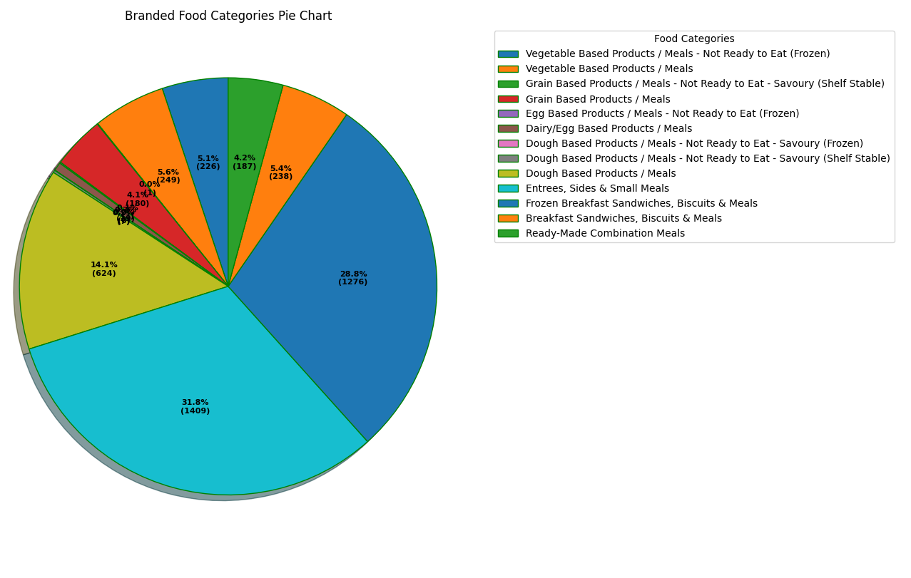

# DC21-Data-Challenge
## Packaged Meals Dataset:
Packaged Meals dataset was released by United States Department of Agriculture for the enhancement of public health. The overview of food categories in the dataset can be found in this image:

## Software Used:
1. Python version 3.8

## Libraries Used:
1. Matplotlib
2. Pandas

## Project Presentation:
Please click [here](https://github.com/Eashwar-S/DC21-Data-Challenge/blob/master/presentation/DC21067-Presentation.pdf)

## Project Abstract:
Please click [here](https://github.com/Eashwar-S/DC21-Data-Challenge/blob/master/proposal/Proposal_DC21067.pdf)